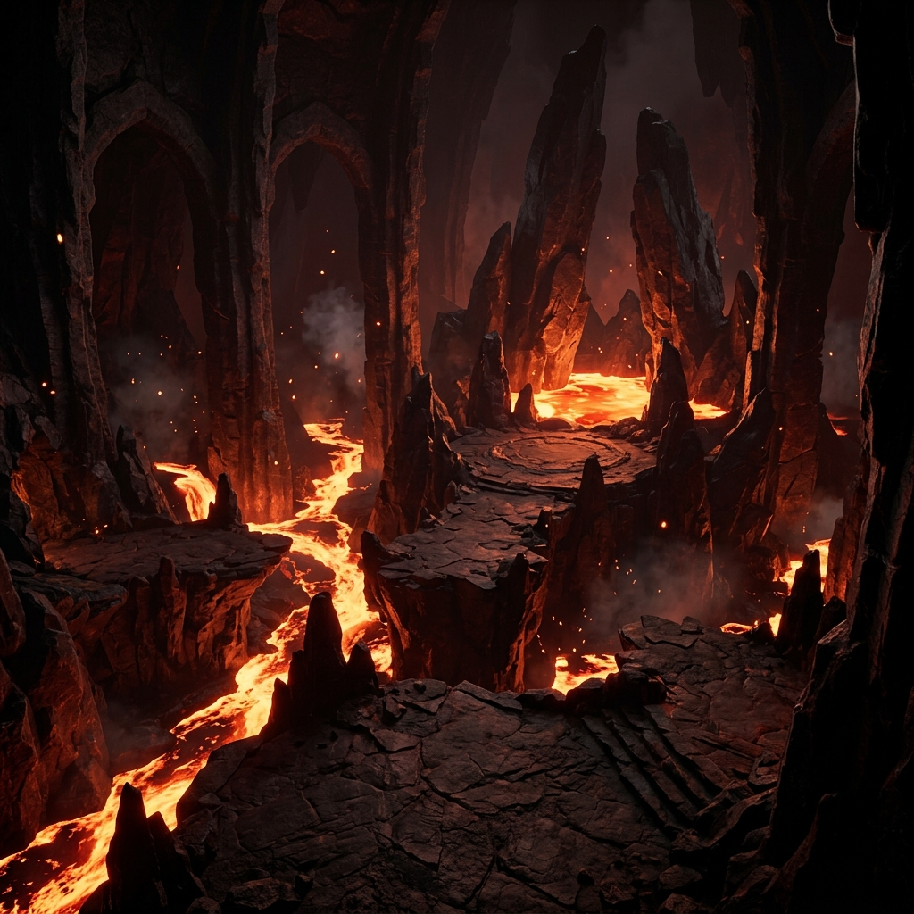
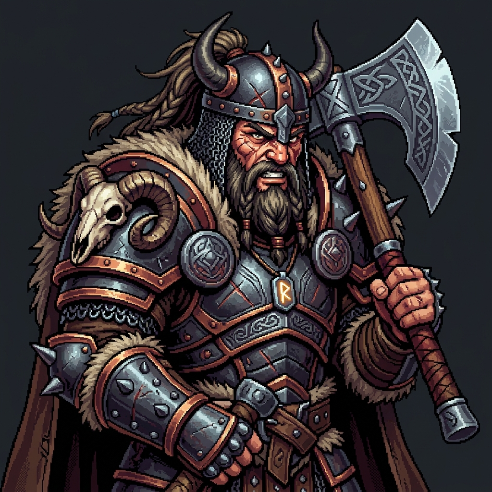
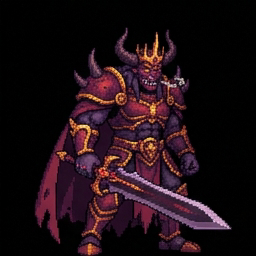
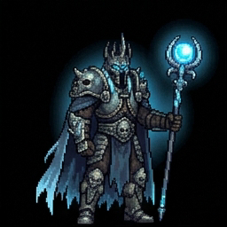
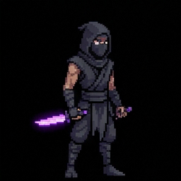
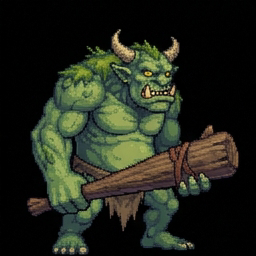

  
  <h1>⚔️ 24 Game: RPG Edition</h1>
  
A fast-paced, math-puzzle RPG where your arithmetic skills keep you alive.

  
  

---

## 🎮 Play the Game
**[👉 Click here to play the game directly in your browser!](https://jackbauertv24-droid.github.io/24-game/index.html)**

*Optimized for both iOS/Android mobile and desktop browsers.*

## 📜 About
This project transforms the classic **24 Math Puzzle** into a fully animated, high-stakes RPG. You are racing against a 60-second timer. Every time you successfully combine four numbers to equal exactly **24** (evaluated strictly Left-to-Right), you strike the enemy and gain bonus time. Run out of time, and you die.

### ✨ Features
* **4 Unique Playable Classes:** 
  * 🪓 **Warrior:** Sacrifice time to execute enemies instantly with *Intimidate*.
  * 🗡️ **Rogue:** Reroll annoying numbers with *Sleight of Hand*.
  * 🔮 **Wizard:** Farm massive bonus time with *Arcane Surge* by solving with division.
  * 🛡️ **Paladin:** Survive lethal blows and heal with *Smite*.
* **Massive Bestiary:** Battle against **24 unique AI-generated, fully animated monsters**, ranging from Goblin Thieves to the terrifying Demon King.
* **Campaign & Endless Modes:** Conquer 30 hand-curated levels across three distinct difficulty tiers, or see how long you can survive in Endless Mode.
* **Zero Dependencies:** Built completely in a single `index.html` file using Vanilla JavaScript, HTML, and CSS. No React, no bundlers, no bloat.

## 🖼️ Gallery

  
  
  
  
  

 

## 🛠️ Architecture Notes
* **Sprite Animation:** The game dynamically animates static AI-generated sprite sheets (4x4 grids) using vanilla Javascript timing loops and CSS `background-position` shifting.
* **Transparent Blending:** Black backgrounds on the AI sprites are rendered fully transparent over the arenas using CSS `mix-blend-mode: screen`.
* **Algorithmic Verification:** Every single puzzle generated in the game is brute-force verified mathematically in the background to guarantee it is 100% solvable under strict left-to-right rules.
